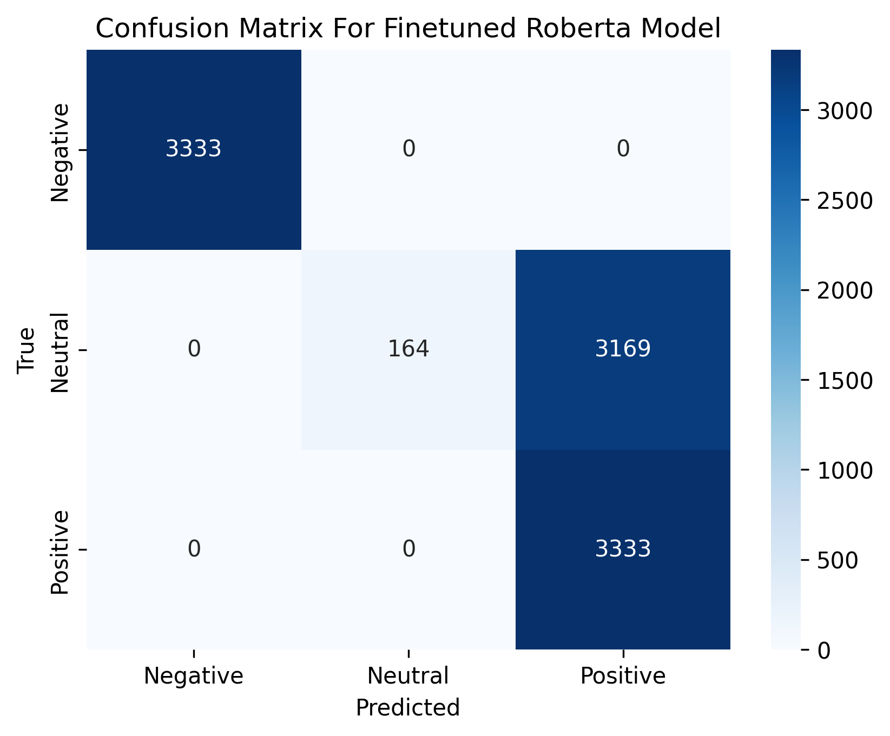
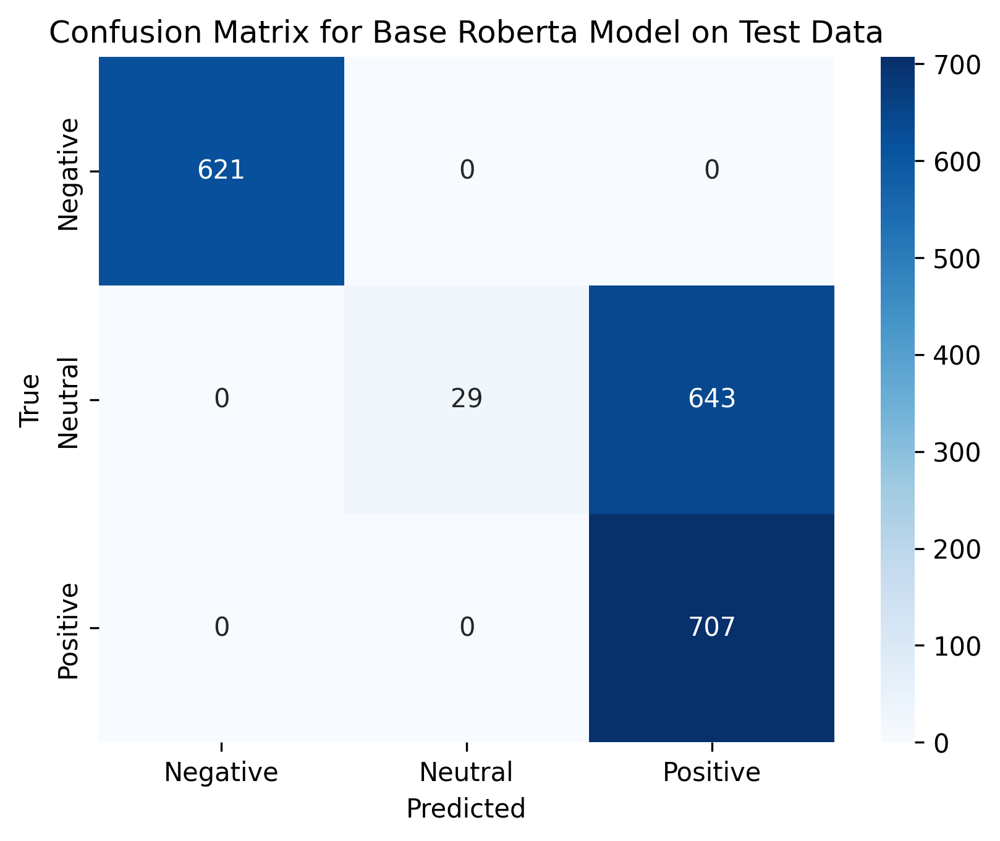
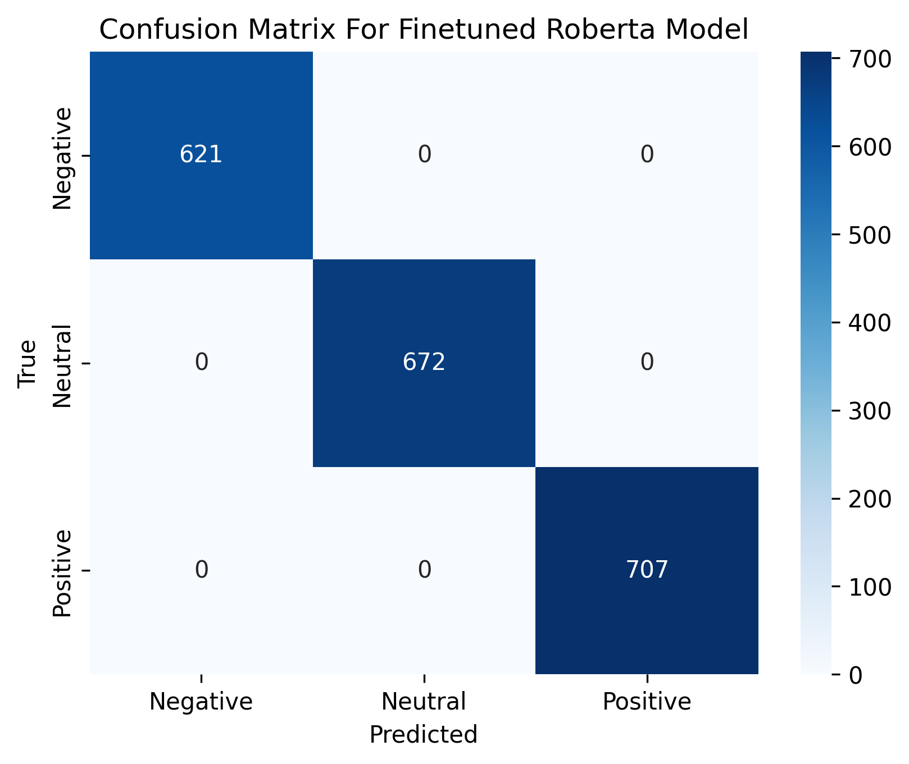
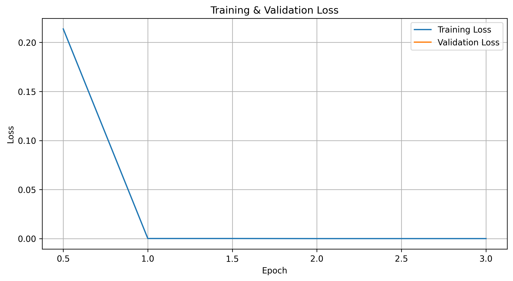

# 📊 Fine-Tuned RoBERTa for Electronics Product Sentiment Analysis

This project fine-tunes the `roberta-base` model for a multi-class sentiment classification task on electronics product reviews. 
The goal was to improve classification accuracy.

---

## 🧠 Overview

**Model:** RoBERTa-base (pretrained)
**Task:** Sentiment classification (Negative, Neutral, Positive)
**Dataset:** 9,999 labeled electronics product reviews
**Labels:** 3 classes — Negative (0), Neutral (1), Positive (2)
**Approach:**
  - Evaluate base model using zero-shot inference
  - Fine-tune using 80% of the dataset
  - Test and compare using the remaining 20%
---

## 📁 Project Structure

├── data/

├── logs/

├── plots/

├── scripts/

├── notebooks/

└── README.md

└── mini-report.htm

---

## 🧪 Methodology

1. **Zero-shot Evaluation**  
   The base `roberta-base` model was first evaluated in a zero-shot manner, where predictions were made using class labels as hypotheses. Performance was particularly weak for the "Neutral" class.
   
| Class            | Precision | Recall | F1-score | Support |
|------------------|-----------|--------|----------|---------|
| Negative         | 1.00      | 1.00   | 1.00     | 3333    |
| Neutral          | 1.00      | 0.05   | 0.09     | 3333    |
| Positive         | 0.51      | 1.00   | 0.68     | 3333    |
| **Accuracy**     |           |        | **0.68** | 9999    |
| Macro avg        | 0.84      | 0.68   | 0.59     | 9999    |
| Weighted avg     | 0.84      | 0.68   | 0.59     | 9999    |

3. **Fine-Tuning**  
   The model was fine-tuned on 80% of the labeled dataset. Hyperparameters:
   - Epochs: 3
   - Batch Size: 8
   - Weight Decay: 0.01
   - Learning Rate Scheduler: Warm-up steps = 500

4. **Evaluation**  
   The remaining 20% was used to test both the zero-shot model and the fine-tuned model. Key metrics included precision, recall, F1-score, and accuracy.

---

## 📈 Results

### 🔍 Base Model (Zero-shot) on Test Set

| Class            | Precision | Recall | F1-score | Support |
|------------------|-----------|--------|----------|---------|
| Negative         | 1.00      | 1.00   | 1.00     | 621     |
| Neutral          | 1.00      | 0.04   | 0.08     | 672     |
| Positive         | 0.52      | 1.00   | 0.69     | 707     |
| **Accuracy**     |           |        | **0.68** | 2000    |
| Macro avg        | 0.83      | 0.68   | 0.59     | 2000    |
| Weighted avg     | 0.84      | 0.68   | 0.58     | 2000    |

### ✅ Fine-Tuned Model on Same Test Set

| Class            | Precision | Recall | F1-score | Support |
|------------------|-----------|--------|----------|---------|
| Negative         | 1.00      | 1.00   | 1.00     | 621     |
| Neutral          | 1.00      | 1.00   | 1.00     | 672     |
| Positive         | 1.00      | 1.00   | 1.00     | 707     |
| **Accuracy**     |           |        | **1.00** | 2000    |
| Macro avg        | 1.00      | 1.00   | 1.00     | 2000   |
| Weighted avg     | 1.00      | 1.00   | 1.00     | 2000    |

---

## 📊 Statistical Significance

To ensure improvements were meaningful:

- **McNemar's Test** was performed between base and fine-tuned model predictions.
- **p-value = 0.00000**, indicating **statistically significant improvement** (p < 0.05).

---

## 📉 Loss Curve

Training and validation loss across epochs was plotted and saved at:

---

## 🔍 Observations & Notes

- The **base model** severely underperformed on the Neutral class.
- After fine-tuning, performance improved dramatically, reaching perfect classification. However:
  - Perfect metrics are **unusual** and suggest possible **overfitting** or **data redundancy**.
  - Reviews were found to have **similar structure and vocabulary**, possibly aiding memorization.
  - No data leakage was found (data was split before training).

---

